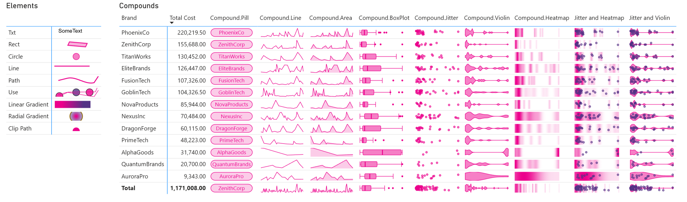

# DaxLib.SVG

A DAX User-Defined Functions (UDF) library designed to make creating SVG visuals in Power BI easier

[Download From DaxLib :material-download:{ style="color: var(--button-color); font-size: 1.2em;" }](https://daxlib.org/package/daxlib.svg/){ .md-button }
[Download Example PBIP :material-download:{ style="color: var(--button-color); font-size: 1.2em;" }](https://github.com/daxlib/docs-daxlib-svg/tree/main/PowerBI){ .md-button } 

!!! tip "Getting Started"

    1. Download the library from [DaxLib](https://daxlib.org/package/DaxLib.SVG/)
    2. Install using TMDL view
    3. Start using the functions in your measures
     
    For detailed examples, check out our example [PBIP file](https://github.com/daxlib/docs-daxlib-svg/tree/main/PowerBI)

